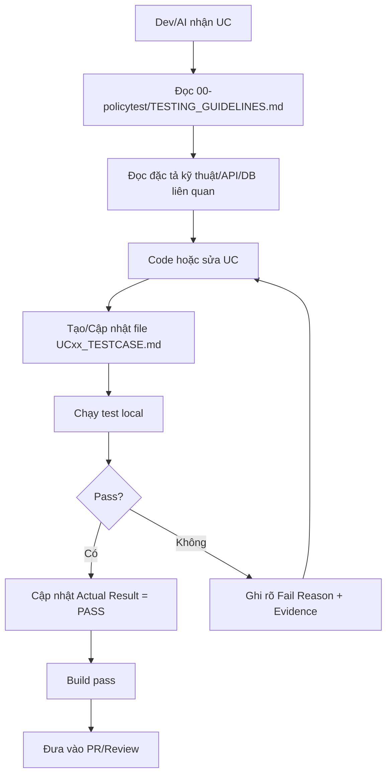

# README - Bộ Test Case Theo Use Case

Thư mục này dùng để lưu toàn bộ tài liệu test case cho từng Use Case (UC) của dự án **MyFschool Electronic Contact Book**.

Mục tiêu chính:

1. Mỗi khi nhóm hoàn thành code cho 1 UC, phải có file test case tương ứng để QA/dev/AI kiểm thử.
2. Test case phải đồng bộ với đặc tả kỹ thuật, database và API/backend/frontend đang code.
3. AI khi được giao code phải đọc bộ quy tắc chung trước, sau đó đọc test case của UC đang làm.
4. Không merge code nếu UC chưa có checklist test rõ ràng hoặc test fail chưa được ghi nhận.

---

## 1. Cấu trúc đề xuất

```text
Test_Cases/
├── README.md
├── UC_TESTCASE_TEMPLATE.md
├── TESTCASE_INDEX.md
└── UCxx_<ten-use-case>_TESTCASE.md
```

Ví dụ:

```text
UC01_Authentication_TESTCASE.md
UC08_RealtimeChat_TESTCASE.md
UC09_Notifications_TESTCASE.md
UC10_GradeManagement_TESTCASE.md
```

---

## 2. Quy tắc đặt tên file

Format bắt buộc:

```text
UC<so-thu-tu-2-chu-so>_<ten-ngan-gon-bang-tieng-anh>_TESTCASE.md
```

Ví dụ đúng:

```text
UC01_Authentication_TESTCASE.md
UC08_RealtimeChat_TESTCASE.md
UC10_GradeManagement_TESTCASE.md
```

Ví dụ sai:

```text
Test đăng nhập.md
chat.md
UC tin nhắn.docx
```

---

## 3. Quy tắc mã test case

Format bắt buộc:

```text
TC-<MODULE>-<TYPE>-<NNN>
```

Trong đó:

| Thành phần | Ý nghĩa | Ví dụ |
| :--- | :--- | :--- |
| `MODULE` | Mã module viết hoa | `AUTH`, `CHAT`, `GRADE`, `NOTIFY`, `ADMIN` |
| `TYPE` | Loại test | `UNIT`, `INT`, `API`, `UI`, `SEC`, `E2E` |
| `NNN` | Số thứ tự 3 chữ số | `001`, `002` |

Ví dụ:

```text
TC-AUTH-API-001
TC-CHAT-SEC-001
TC-CHAT-E2E-001
TC-GRADE-UNIT-002
```

---

## 4. Khi nào phải tạo test case?

Bắt buộc tạo hoặc cập nhật test case khi:

- Tạo mới một UC.
- Code xong một feature trong UC.
- Sửa bug liên quan logic nghiệp vụ.
- Thêm/sửa API endpoint hoặc WebSocket event.
- Thêm/sửa database table/column/constraint.
- Thêm/sửa rule phân quyền.
- Thêm/sửa flow nhắn tin, xác thực, quản lý điểm, thông báo.

---

## 5. Luồng làm việc chuẩn sau khi code xong 1 UC



---

## 6. Tài liệu liên quan bắt buộc đọc

Trước khi viết test case, phải kiểm tra:

| Tài liệu | Mục đích |
| :--- | :--- |
| `00-policytest/TESTCASE_WRITING_GUIDE.md` | Hướng dẫn viết test case đúng format |
| `00-policytest/TESTING_GUIDELINES.md` | Tiêu chuẩn kiểm thử kỹ thuật |
| `UC_TESTCASE_TEMPLATE.md` | Mẫu gốc để copy khi tạo test case mới |
| `docs/superpowers/specs/` | Đặc tả kỹ thuật các phase |
| `docs/superpowers/plans/` | Kế hoạch triển khai chi tiết |
| `docs/database.md` | Thiết kế cơ sở dữ liệu |

---

## 7. Definition of Done cho mỗi UC

Một UC chỉ được xem là hoàn thành khi:

- [ ] Có file test case riêng trong `Test_Cases/`.
- [ ] Có trace tới requirement/đặc tả/API/database liên quan.
- [ ] Có ít nhất happy path + validation/error path + permission path nếu UC có auth.
- [ ] Nếu UC có dữ liệu nhạy cảm thì có security/privacy test.
- [ ] Nếu UC có API/WebSocket thì có API test.
- [ ] Nếu UC có UI thì có UI test.
- [ ] Nếu UC thay đổi trạng thái nghiệp vụ thì có state transition test.
- [ ] Build backend/frontend pass.
- [ ] Test result được ghi rõ: `Not Run`, `Pass`, `Fail`, hoặc `Blocked`.
- [ ] Fail/Blocked phải có lý do và evidence.

---

## 8. Gợi ý module chính của dự án

| Module | Mã module | UC chính |
| :--- | :--- | :--- |
| Authentication & User Profile | `AUTH` | Đăng ký, đăng nhập, phân quyền (JWT) |
| Real-time Chat | `CHAT` | Nhắn tin WebSocket, trạng thái tin nhắn, typing indicator, presence |
| Grade Management | `GRADE` | Quản lý điểm số, thống kê học tập |
| Notifications | `NOTIFY` | Thông báo push (FCM), thông báo trong app |
| Schedule & Timetable | `SCHEDULE` | Thời khóa biểu, lịch học |
| Admin Management | `ADMIN` | Dashboard quản trị, quản lý tài khoản |

---

## 9. Ghi chú quan trọng

- Không dùng dữ liệu cá nhân thật trong test case.
- Dữ liệu test phải là synthetic/anonymized.
- Không ghi password/token/API secret thật vào markdown.
- Không đánh dấu `PASS` nếu chưa thật sự chạy kiểm thử hoặc chưa có bằng chứng.
- Không xóa lịch sử thay đổi trong file test case; chỉ thêm changelog.
